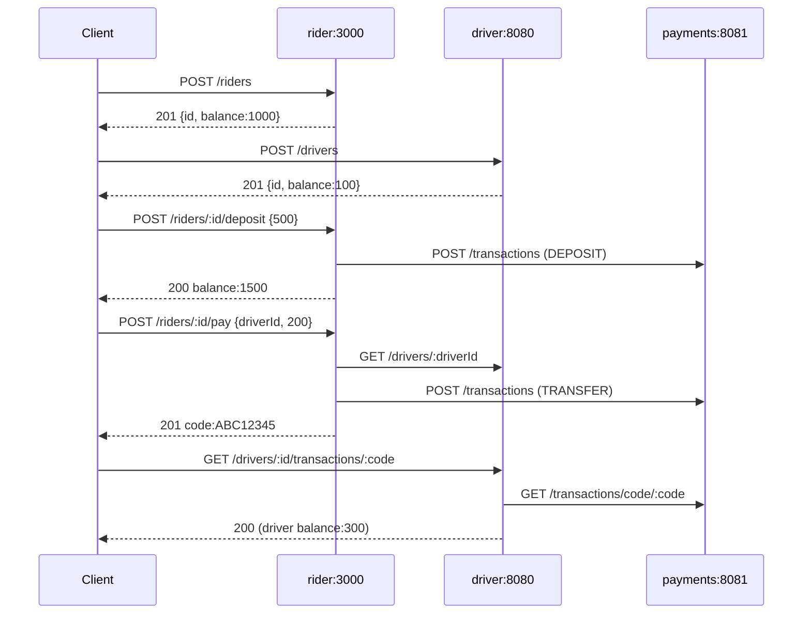

# mobility-inc

Coding exercise: a rideshare backend focused on **payment processing and validation**, implemented as **3 services in 3 different languages** that talk over REST.

| Service    | Stack              | Port | Initial balance | Responsibilities |
|------------|--------------------|------|-----------------|------------------|
| `rider`    | NestJS / TS        | 3000 | 1000            | Register riders, deposit, pay drivers (gets a transfer code) |
| `driver`   | Spring Boot / Java | 8080 | 100             | Register drivers, withdraw, verify transfer codes (idempotent credit) |
| `payments` | Go (stdlib)        | 8081 | -               | Records every transaction (DEPOSIT / WITHDRAWAL / TRANSFER), generates 8-char codes, enforces validation |

The full domain rules, REST contracts, sequence diagram and acceptance criteria live in [`.gsd/PRD.md`](./.gsd/PRD.md) and [`.gsd/CONTRACTS.md`](./.gsd/CONTRACTS.md).

---

## Architecture



Persistence is **in-memory per service** (Map / ConcurrentHashMap / mutex-guarded map). No database. The `payments` service is the only one that records transactions; balances live with `rider` and `driver`.

---

## How to use / execute the system

> Requires **once the build is finished** (see "Build via GSD orchestration" below): `docker`, `docker compose`, `jq`, `curl`.

```bash
# 1. Build and start all 3 services
docker compose up -d --build

# 2. Wait until all healthchecks are green (~60s for the JVM)
docker compose ps

# 3. Run the full E2E acceptance script (13 steps from PRD.md)
bash scripts/e2e.sh

# 4. Tear down
docker compose down -v
```

A successful `scripts/e2e.sh` exits with code `0` and exercises: register rider + driver, deposit, pay (capture code), driver verifies code, idempotent re-verification, insufficient funds (400), self-transfer guard (422), validation (400).

_Validated end-to-end on 2026-05-01 via `scripts/e2e.sh` (exit code 0)._

### Per-service local dev

```bash
# rider (NestJS)
cd rider && npm install && npm run start:dev   # http://localhost:3000

# driver (Spring Boot)
cd driver && ./gradlew bootRun                 # http://localhost:8080

# payments (Go)
cd payments && go run ./...                    # http://localhost:8081
```

Inter-service URLs are read from env (`PAYMENTS_URL`, `DRIVER_URL`); compose wires them automatically.

---

## Build via GSD orchestration (Codex agents)

This repo is being built using a **GSD (Get Stuff Done)** orchestration pattern with multiple AI agents collaborating under a strict plan/contract handshake. The orchestration state lives in `.gsd/` (gitignored; resumable across sessions on the same machine).

### Roles

| Phase            | Agent                              | Mode      | Output |
|------------------|------------------------------------|-----------|--------|
| 0. Setup         | `claude-opus-4-7-thinking-xhigh`   | write     | scaffold `.gsd/` + branch `feat/mvp-e2e` |
| 1. Crawl / eval  | `claude-4.6-sonnet-medium-thinking`| readonly  | `.gsd/EVAL.md` (per-service inventory + gaps) |
| 2. Plan          | `claude-opus-4-7-thinking-xhigh`   | write     | `.gsd/PRD.md` + `.gsd/CONTRACTS.md` (FROZEN) + `.gsd/TASKS.md` (36 atomic tasks) |
| 3. **Build (parallel)** | `gpt-5.3-codex` x3          | write     | `feat/rider`, `feat/driver`, `feat/payments` (one Codex per service) |
| 4. Integrate     | `gpt-5.3-codex` (integrator)       | write     | merge into `feat/mvp-e2e` + `docker-compose.yml` + `scripts/e2e.sh` |

### Files in `.gsd/`

| File           | Purpose                                                                 |
|----------------|-------------------------------------------------------------------------|
| `STATE.json`   | Current phase, branch, subagent ids, next action. The single resumable handle. |
| `LOG.md`       | Append-only timeline (`YYYY-MM-DDTHH:MM:SSZ \| agent \| event`).        |
| `PRD.md`       | Problem, objective, scope, acceptance criteria.                          |
| `CONTRACTS.md` | **FROZEN** REST contracts. No agent may deviate without orchestrator approval. |
| `EVAL.md`      | Sonnet's per-service inventory + risks (input to the plan phase).        |
| `TASKS.md`     | 36 atomic tasks (`T-{SERVICE}-NN`), one Codex pass each, with verifiable DoD. |

### Execute / resume the orchestration

This is driven by the human pairing with the orchestrator agent (Opus). To resume in a new chat session, paste:

```
Read .gsd/STATE.json and continue from "next_action".
```

The orchestrator will:
1. Read `STATE.json` to find the current phase.
2. Read `LOG.md` for history.
3. Either dispatch the next subagent or wait for a `STOP MANUAL` user approval gate (used between Plan -> Build).

### Run a single Codex agent manually (debug)

If a service agent needs a re-run, the orchestrator dispatches it on its own branch with the relevant `T-{SERVICE}-*` task slice as the prompt. Codex agents:

- Work **only** inside their service folder (`rider/`, `driver/`, or `payments/`).
- Must respect `.gsd/CONTRACTS.md` (frozen).
- Mark each task `[x]` when its DoD passes; `[!]` if blocked (with reason logged).
- Never modify `.gsd/CONTRACTS.md` or other services' files.

### Branch strategy

```
main
  └── feat/mvp-e2e          (integration target, current orchestrator branch)
        ├── feat/rider      (Codex #1 – NestJS)
        ├── feat/driver     (Codex #2 – Spring Boot)
        └── feat/payments   (Codex #3 – Go)
```

After the 3 service branches are green (unit tests + Dockerfile builds), the integrator merges them into `feat/mvp-e2e` and adds `docker-compose.yml` + `scripts/e2e.sh`. No `git push`, no PRs - integration is local until the human releases it.

---

## Original problem statement

> Coding exercise, using 3 different languages create 3 services for a rideshare app with a focus on payment processing and validation. The services are rider, driver and payment.
>
> Drivers and riders should be bare-bones, login with social auth, a rider has initial amount of 1000 funds and a driver has 100. A driver can be a rider but can't move money to themselves. A rider can deposit to increase its balance and a driver can withdraw its balance.
>
> A driver and a rider can view their profiles with basic info, funds, name, email.
>
> A rider can send funds to a driver; a unique code is generated that the driver uses to verify payment. A driver should get the payment by its unique code to verify if the payment was made to him.
>
> Every transaction goes through the payments service; the payments service validates transactions (who sends, to whom, amount, unique code). Deposits and withdrawals are also transactions.

> **MVP scope decisions** (see `.gsd/PRD.md` for the full list): social auth is stubbed via `X-User-Id` header (no real OAuth2); persistence is in-memory; no `Ride` entity; balance authority lives with `rider` and `driver`, `payments` only records and validates.
