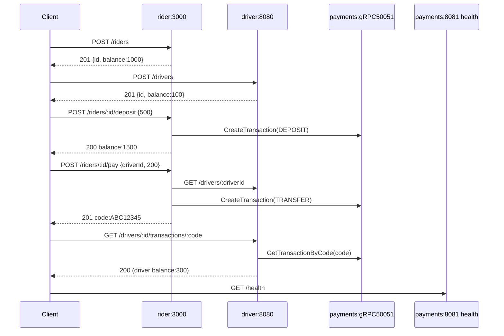

# mobility-inc

`mobility-inc` is a rideshare backend focused on **payment processing and validation**, implemented as **3 services in 3 different languages**. Public APIs are REST in `rider` and `driver`; internal transaction calls to `payments` use gRPC.

| Service    | Stack              | Port | Initial balance | Responsibilities |
|------------|--------------------|------|-----------------|------------------|
| `rider`    | NestJS / TS        | 3000 | 1000            | Register riders, deposit, pay drivers (gets a transfer code) |
| `driver`   | Spring Boot / Java | 8080 | 100             | Register drivers, withdraw, verify transfer codes (idempotent credit) |
| `payments` | Go (stdlib + gRPC) | 8081 (health), 50051 (gRPC) | - | Records every transaction (DEPOSIT / WITHDRAWAL / TRANSFER), generates 8-char codes, enforces validation |

## Architecture



Persistence is **Postgres-backed per service** via Docker Compose (`postgres-rider`, `postgres-driver`, `postgres-payments`) with health checks and persistent named volumes. Local development auth/email dependencies are provided by `AUTH_STUB=true` and Mailpit.

---

## How to use / execute the system

> Requires: `docker`, `docker compose`, `jq`, `curl`.

```bash
# 0. Define local secrets (or copy from .env.example)
cp .env.example .env

# 1. Build and start all 3 services
docker compose up -d --build

# 2. Wait until all healthchecks are green (~120s with DB + JVM startup)
docker compose ps

# 3. Run the full E2E acceptance script
bash scripts/e2e.sh

# 4. Tear down
docker compose down -v
```

A successful `scripts/e2e.sh` exits with code `0` and exercises: auth-stub token issuance, register rider + driver, deposit, pay (capture code), driver verifies code, idempotent re-verification, insufficient funds (400 semantics), gRPC self-transfer guard (`FAILED_PRECONDITION`), validation (400), and rider restart persistence.

_Validated end-to-end on 2026-05-02 via `scripts/e2e.sh` (exit code 0); exercises Postgres-backed persistence, internal gRPC payments calls, and restart persistence assertion._

### Per-service local dev

```bash
# rider (NestJS)
cd rider && npm install && npm run start:dev   # http://localhost:3000

# driver (Spring Boot)
cd driver && ./gradlew bootRun                 # http://localhost:8080

# payments (Go)
cd payments && go run ./...                    # http://localhost:8081
```

Inter-service URLs are read from env (`PAYMENTS_GRPC_URL`, `DRIVER_URL`, `DATABASE_URL`, `SMTP_HOST`); compose wires them automatically.

Local secret/config values are loaded from `.env` (for example: `MOBILITY_DB_PASSWORD`, `JWT_SECRET`). Do not commit `.env`.

### Local support services

- Mailpit UI/API: [http://localhost:8025](http://localhost:8025)
- payments gRPC endpoint: `payments:50051` inside compose network
- payments HTTP health endpoint: [http://localhost:8081/health](http://localhost:8081/health)
